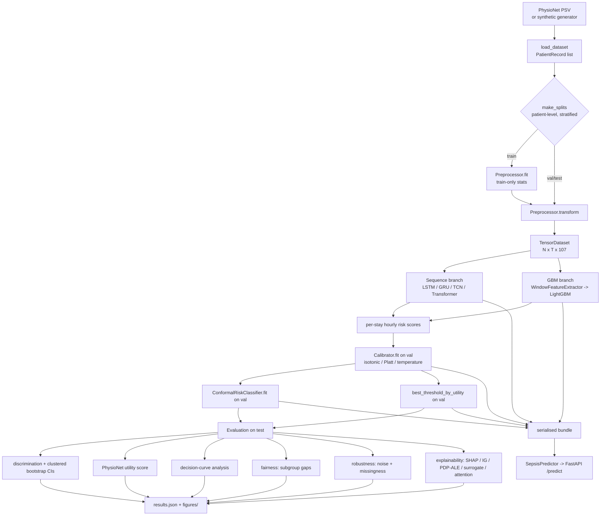

# Architecture

## Pipeline



## Package layout

| package | responsibility |
| --- | --- |
| `sepsis.data` | PSV IO, synthetic cohort, leak-free splitting, GRU-D-style preprocessing, torch datasets |
| `sepsis.features` | sliding-window tabular features for the GBM |
| `sepsis.models` | masked losses, causal LSTM/GRU/TCN/Transformer, LightGBM wrapper, registry |
| `sepsis.training` | trainer (early stopping, MLflow), `run_experiment` orchestrator, `sepsis` CLI |
| `sepsis.evaluation` | metrics, official utility score, clustered bootstrap, decision curves |
| `sepsis.uncertainty` | calibration + diagnostics, split/Mondrian conformal, MC-dropout |
| `sepsis.explain` | TreeSHAP, Integrated Gradients, PDP/ALE, global surrogate tree, attention rollout |
| `sepsis.audit` | subgroup fairness, perturbation/shift robustness |
| `sepsis.reporting` | headless matplotlib figures |
| `sepsis.serve` | Pydantic schemas, `SepsisPredictor`, FastAPI app |

## Serialised bundle (`artifacts/<run>/`)

```
config.json           full ExperimentConfig (round-trips)
preprocess.json       PreprocessArtifacts: frozen feature order + train stats
model.pt | model.txt  torch checkpoint (best val AUPRC) or LightGBM text model
calibrator.joblib     fitted post-hoc calibrator
conformal.joblib      fitted ConformalRiskClassifier
operating_point.json  {alarm_threshold, conformal_alpha}
results.json          every metric, CI, subgroup table, robustness curve, ranking
figures/*.png         reliability, decision curve, robustness, utility-threshold,
                      subgroup gaps, global attributions, example trajectory,
                      training history
surrogate_rules.txt   human-readable depth-4 surrogate tree
```
